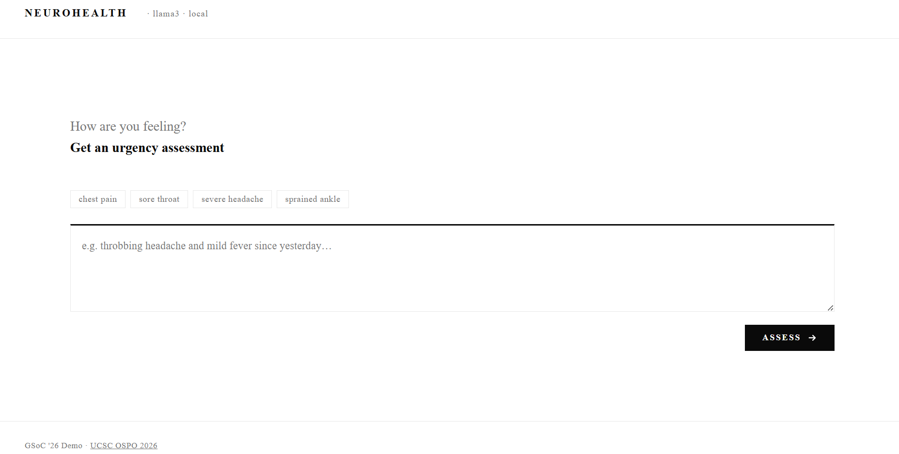
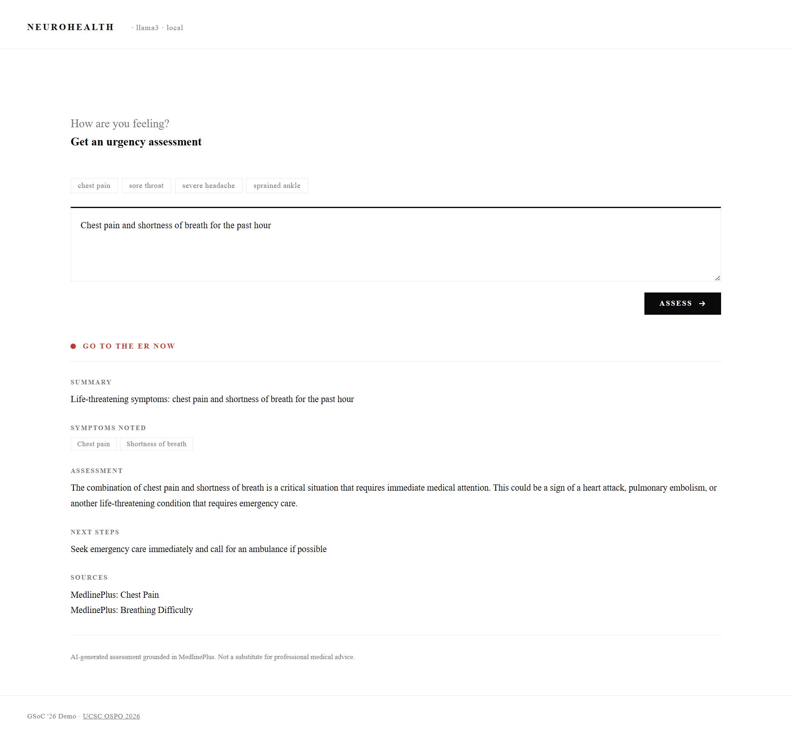

# NeuroHealth

A local AI-powered symptom triage demo built for the [UCSC OSPO 2026 GSoC project](https://ucsc-ospo.github.io/project/osre26/nelbl/neurohealth/).

This project explores how Large Language Models can be used to build intelligent, conversational health assistants that interpret symptoms, assess urgency, and guide users toward appropriate care.


<p align="center">

</p>
<p align="center">

</p>


## What this demo does

A user describes their symptoms in plain language. The application retrieves relevant clinical context from a local knowledge base of MedlinePlus entries, injects that context into the prompt, and sends both to a locally running Llama3 model via Ollama. The model returns a structured assessment including urgency level, reasoning, and recommended next steps, which is rendered in the interface.

This implements a minimal Retrieval-Augmented Generation (RAG) pipeline. Rather than relying solely on the model's training data, responses are grounded in validated medical information retrieved at query time. The entire pipeline runs on the user's machine. No data is sent to external servers.

## Relation to the OSPO project

The [NeuroHealth OSPO project](https://ucsc-ospo.github.io/project/osre26/nelbl/neurohealth/) proposes building a full AI-powered health assistant with LLM-based medical reasoning, RAG over clinical knowledge bases, multi-turn dialogue, urgency assessment, and appointment routing. This demo implements a focused slice of that vision: symptom input, knowledge retrieval, and urgency triage as a proof of concept for the broader agenda.


## Setup

Install [Ollama](https://ollama.com) and pull the model:
```bash
ollama pull llama3:latest
```

Allow browser requests and start Ollama:
```bash
# macOS/Linux
OLLAMA_ORIGINS="*" ollama serve

# Windows (PowerShell)
$env:OLLAMA_ORIGINS="*"; ollama serve
```

Serve the file:
```bash
npx serve .
# or
python -m http.server 8000
```

Open `http://localhost:3000`.

## Stack

- **Model**: Llama3 8B via Ollama
- **Retrieval**: keyword-matched local knowledge base (MedlinePlus)
- **Frontend**: vanilla HTML/CSS/JS, single file, zero dependencies

## About

This demo was built as part of a GSoC 2026 application for the [NeuroHealth project](https://ucsc-ospo.github.io/project/osre26/nelbl/neurohealth/) at UCSC OSPO, mentored by Linsey Pang and Bin Dong.

## Disclaimer

Research prototype only. Not a substitute for professional medical advice. In an emergency call your local emergency number immediately.
